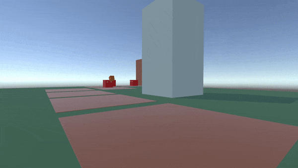

# NEKO : : MISSION

**NEKO : : MISSION** - игра в жанре *Tower Defense* с видом от первого лица.

---

Выполнено в рамках ПД 2023-2024.

## Команда

Трухлов Иван

Сидорченко Михаил

Бондарь Герман

## Цель проекта

Разработать игру в жанре Tower Defense от первого лица

## Текущие задачи

- [ ] Стандартное движение от первого лица ​
- [ ] Одна карта​
- [ ] Два-три вида оборонительных башен ​
- [ ] Несколько типов врагов​
- [ ] Возможность влиять на работу башен​
- [ ] Прокачка башен​
- [ ] Больше типов врагов​
- [ ] Возможность осмотреть поле сверху​
- [ ] Ещё несколько карт​

## Используемые технологии 

Для разработки игры мы используем [Unity][unity] и [C#][cs], для 3D моделирования - [Blender][blender].

[unity]: https://unity.com/ru
[cs]: https://learn.microsoft.com/ru-ru/dotnet/csharp/
[blender]: https://www.blender.org/
